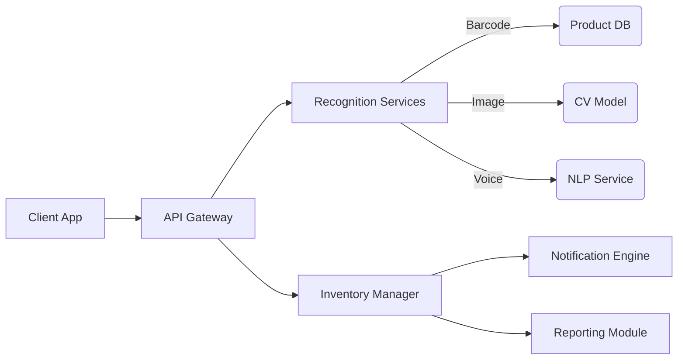

# Pantry Management App Specification

## Core User Goals
- Track pantry/fridge inventory in real-time
- Reduce food waste through expiry management
- Simplify grocery shopping through smart lists
- Support multi-modal input (barcode/image/voice/manual)

## Feature Breakdown
### 1. Input System (Hybrid Auto-Detect)
- **Barcode Scanning**: Primary method for packaged goods
- **Image Recognition**: Fallback for produce/unpackaged items
- **Voice Commands**: "Used 2 eggs", "Added milk"
- **Manual Entry**: Text search + quantity input

### 2. Inventory Management
- **Location Tracking**: 
  - Fridge (temperature zones)
  - Pantry (shelves/categories)
  - Freezer
- **Quantity Types**:
  - Discrete items (eggs, cans)
  - Continuous amounts (milk, grains)
- **Expiry System**:
  - Customizable alert thresholds (3 days/1 day/expired)
  - Partial quantity expiry handling

### 3. Notification System
- Mobile push notifications for:
  - Approaching expirations
  - Critical expirations
  - Low stock alerts
- Configurable quiet hours

### 4. Visualization & Reporting
- **Dashboard Features**:
  - Location-based inventory views
  - Expiry timeline visualization
  - Consumption heatmaps (weekly/monthly)
- **Shopping List Generator**:
  - Auto-populates based on:
    - Consumption patterns
    - Expiring items needing replacement
    - Manual additions
  - Store aisle optimization

## Technical Architecture

## Development Roadmap
| Phase | Duration | Features | Dependencies |
|-------|----------|----------|--------------|
| MVP | 4 weeks | Barcode input, Basic inventory, Expiry alerts, Dashboard | Firebase, Barcode API |
| V1 | 3 weeks | Voice commands, Shopping lists, Enhanced UI | Speech-to-text API |
| V2 | 5 weeks | Image recognition, Analytics, Multi-user | CV training, Data pipeline |

## Open Questions
1. Cloud sync vs local-first data strategy?
2. User authentication model (individual vs household)?
3. Meal planning integration priority?